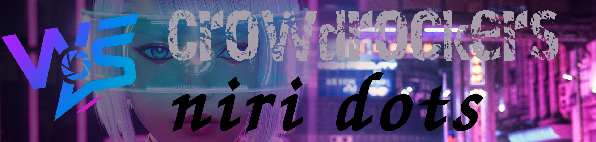

# 🎮 WehttamSnaps Niri Workstation

<div align="center">



**A personalized Arch Linux workstation with Niri compositor**  
*Built for photography, gaming, and streaming*

[](https://archlinux.org/)
[](https://github.com/YaLTeR/niri)
[](LICENSE)

[Features](#-features) • [Installation](#-installation) • [Documentation](#-documentation) • [Community](#-community)

</div>

---

## 📖 About

**WehttamSnaps** is a complete Arch Linux setup featuring the Niri scrollable-tiling compositor, custom Quickshell widgets, and full J.A.R.V.I.S. theme integration. Designed for a seamless workflow between photo editing, gaming, and streaming.

**Created by:** Matthew (WehttamSnaps)  
**Platforms:** [Twitch](https://twitch.tv/WehttamSnaps) • [YouTube](https://youtube.com/@WehttamSnaps) • [GitHub](https://github.com/Crowdrocker)

---

## ✨ Features

### 🎨 Visual Design
- **Color Palette**: Violet-to-cyan gradient (#8A2BE2 → #00FFFF)
- **Theme**: TokyoNight Dark with custom WehttamSnaps branding
- **Animations**: Smooth, modern transitions throughout
- **Compositor**: Niri with scrollable tiling workflow

### 🤖 J.A.R.V.I.S. Integration
- Custom startup/shutdown sounds
- Event-driven audio notifications
- Gaming mode announcements
- System warning alerts
- Streaming mode indicators

### 🎮 Gaming Optimizations
- **Kernel**: linux-zen for gaming performance
- **GPU**: AMD RX 580 optimizations (AMDGPU/RADV)
- **Tools**: GameMode, MangoHud, CoreCtrl, LACT
- **Memory**: ZRAM configuration for better performance
- **Launch Options**: Pre-configured for 16 games

### 🎵 Advanced Audio Routing
- PipeWire-based virtual sink system
- Voicemeter-style audio separation
- qpwgraph visual routing
- Per-application volume control
- OBS streaming integration

### 🛠️ Custom Quickshell Widgets
- Work launcher (GIMP, Inkscape, Krita, Blender)
- Gaming launcher (Steam, Lutris, Heroic, Discord)
- J.A.R.V.I.S. status display
- System monitor
- Power menu with branding

### 📦 Included Applications
- **Terminal**: XFCE Terminal with TokyoNight theme
- **Shell**: Zsh with Starship prompt
- **File Manager**: Thunar with custom actions
- **Launcher**: Fuzzel with WehttamSnaps styling
- **Notifications**: Dunst with J.A.R.V.I.S. sounds
- **Display Manager**: SDDM with SugarCandy theme

---

## 🖥️ System Requirements

### Minimum Specifications
- **CPU**: Intel i5-4430 or equivalent
- **GPU**: AMD RX 580 (or similar AMD GPU)
- **RAM**: 16GB DDR3
- **Storage**: 120GB SSD for system + separate game drive
- **Display**: 1080p monitor

### Recommended Specifications
- **CPU**: Haswell or newer (4th gen Intel or Ryzen)
- **GPU**: AMD RX 580 8GB or better
- **RAM**: 16GB+ DDR4
- **Storage**: 256GB+ NVMe SSD for system

---

## 🚀 Installation

### Quick Install (Recommended)

```bash
# Clone the repository
git clone https://github.com/Crowdrocker/Hypr-Snaps.git
cd Hypr-Snaps

# Make the installer executable
chmod +x install.sh

# Run the interactive installer
./install.sh
```

The installer will guide you through:
1. Base system setup
2. CachyOS repository installation
3. linux-zen kernel installation
4. Niri compositor setup
5. Quickshell and Noctalia installation
6. Gaming optimizations
7. Audio routing configuration
8. J.A.R.V.I.S. integration
9. Theme installation

### Manual Installation

See [INSTALL.md](docs/INSTALL.md) for detailed manual installation steps.

---

## 📁 Repository Structure

```
Hypr-Snaps/
├── README.md                           # You are here
├── install.sh                          # Interactive installer
├── LICENSE                             # MIT License
│
├── configs/                            # Configuration files
│   ├── niri/
│   │   ├── config.kdl                 # Main Niri config
│   │   ├── keybinds.kdl               # Keybindings
│   │   ├── window-rules.kdl           # Window rules
│   │   └── autostart.kdl              # Startup applications
│   ├── quickshell/
│   │   ├── shell.qml                  # Main shell config
│   │   └── widgets/                   # Custom widgets
│   │       ├── work-launcher.qml
│   │       ├── game-launcher.qml
│   │       ├── jarvis-status.qml
│   │       └── templates/             # Widget templates
│   ├── dunst/dunstrc                  # Notification config
│   ├── fuzzel/fuzzel.ini              # Launcher config
│   ├── kitty/kitty.conf               # Terminal config
│   └── zsh/.zshrc                     # Zsh configuration
│
├── scripts/                            # Utility scripts
│   ├── jarvis/                        # J.A.R.V.I.S. scripts
│   │   ├── sound-manager.sh
│   │   ├── startup.sh
│   │   ├── shutdown.sh
│   │   └── gaming-mode.sh
│   ├── audio/                         # Audio routing scripts
│   │   ├── qpwgraph-setup.sh
│   │   └── virtual-sinks.sh
│   ├── gaming/                        # Gaming utilities
│   │   ├── gamemode-toggle.sh
│   │   └── performance-mode.sh
│   └── utilities/                     # General utilities
│       ├── widget-manager.sh
│       ├── backup-config.sh
│       └── update-keybinds.sh
│
├── assets/                             # Media assets
│   ├── jarvis-sounds/                 # J.A.R.V.I.S. audio files
│   ├── wallpapers/                    # WehttamSnaps wallpapers
│   ├── icons/                         # Custom icons
│   └── logos/                         # Brand logos
│
├── themes/                             # Theme files
│   ├── gtk/                           # GTK themes
│   ├── qt/                            # Qt themes
│   └── sddm/                          # SDDM theme
│
└── docs/                               # Documentation
    ├── INSTALL.md                     # Installation guide
    ├── KEYBINDS.md                    # Keybind reference
    ├── QUICKSHELL-WIDGETS.md          # Widget creation guide
    ├── AUDIO-SETUP.md                 # Audio routing guide
    ├── GAMING-GUIDE.md                # Gaming optimization guide
    ├── STEAM-LAUNCH-OPTIONS.md        # Steam launch options
    └── TROUBLESHOOTING.md             # Common issues & fixes
```

---

## 🎹 Default Keybindings

| Keybind | Action |
|---------|--------|
| `Mod + Return` | Open terminal |
| `Mod + D` | Application launcher |
| `Mod + Q` | Close window |
| `Mod + F` | Fullscreen window |
| `Mod + H/J/K/L` | Focus window (Vim-style) |
| `Mod + Shift + H/J/K/L` | Move window |
| `Mod + 1-9` | Switch to workspace |
| `Mod + Shift + 1-9` | Move window to workspace |
| `Mod + G` | Toggle gaming mode |
| `Mod + A` | Open qpwgraph |
| `Mod + Shift + A` | Open pavucontrol |
| `Print` | Screenshot (area) |
| `Mod + Print` | Screenshot (full) |
| `Mod + Shift + E` | Exit Niri |

**Full keybind list**: [KEYBINDS.md](docs/KEYBINDS.md)

---

## 🎮 Gaming Setup

### Supported Games (Pre-configured)
- Call of Duty HQ
- Cyberpunk 2077
- Fallout 4
- FarCry 5
- Ghost Recon Breakpoint
- Marvel's Avengers
- Need for Speed Payback
- Rise of the Tomb Raider
- Shadow of the Tomb Raider
- The First Descendant
- The Division 1 & 2
- Warframe
- Watch Dogs 1, 2, & Legion

### Steam Launch Options Template
```bash
gamemoderun mangohud %command%
```

See [STEAM-LAUNCH-OPTIONS.md](docs/STEAM-LAUNCH-OPTIONS.md) for game-specific configurations.

### Performance Tools
- **GameMode**: Automatic CPU priority for games
- **MangoHud**: FPS and performance overlay
- **CoreCtrl**: GPU control and profiles
- **LACT**: AMD GPU monitoring
- **ZRAM**: Compressed RAM for better memory management

---

## 🎵 Audio Routing

WehttamSnaps uses PipeWire with virtual sinks to replicate Voicemeter functionality:

### Virtual Sinks
- **Game Audio**: Separate game sound
- **Discord Audio**: Voice chat isolation
- **Browser Audio**: YouTube/Twitch streams
- **Music Audio**: Spotify/music players

### Tools
- **qpwgraph**: Visual audio routing (like Voicemeter)
- **pavucontrol**: Simple volume control
- **EasyEffects**: Audio effects and processing

**Complete guide**: [AUDIO-SETUP.md](docs/AUDIO-SETUP.md)

---

## 🤖 J.A.R.V.I.S. Theme

### Sound Events
- **Startup**: "Allow me to introduce myself, I am JARVIS..."
- **Shutdown**: "Shutting down. Have a good day, Matthew."
- **Notification**: "Matthew, you have a notification."
- **Warning**: "Warning: System temperature critical."
- **Gaming Mode**: "Gaming mode activated. Maximum performance."
- **Streaming Mode**: "Streaming systems online. All feeds operational."

### Installation
1. Place sound files in `~/.config/jarvis-sounds/`
2. Sounds automatically trigger on system events
3. Integrate with Dunst, Niri, and custom scripts

**Sound files**: Created from [101soundboards.com](https://www.101soundboards.com/)

---

## 📚 Documentation

- **[Installation Guide](docs/INSTALL.md)**: Detailed installation instructions
- **[Keybinds Reference](docs/KEYBINDS.md)**: Complete keybinding list
- **[Quickshell Widgets](docs/QUICKSHELL-WIDGETS.md)**: Creating custom widgets
- **[Audio Setup](docs/AUDIO-SETUP.md)**: Advanced audio routing guide
- **[Gaming Guide](docs/GAMING-GUIDE.md)**: Optimization and tweaks
- **[Troubleshooting](docs/TROUBLESHOOTING.md)**: Common issues and fixes

---

## 🤝 Community

### Discord Server
Join the WehttamSnaps community for help, gaming, and Linux discussion:
**[https://discord.gg/nTaknDvdUA](https://discord.gg/nTaknDvdUA)**

#### Channels
- 🎮 Gaming (The Division, First Descendant, etc.)
- 🐧 Linux Help & Tips
- 📸 Photography Showcase
- 🎥 Streaming Discussion
- 💬 General Chat

### Social Media
- **Twitch**: [WehttamSnaps](https://twitch.tv/WehttamSnaps)
- **YouTube**: [WehttamSnaps](https://youtube.com/@WehttamSnaps)
- **GitHub**: [Crowdrocker](https://github.com/Crowdrocker)

---

## 🌟 Credits & Inspiration

### Projects
- **[Niri](https://github.com/YaLTeR/niri)**: The amazing scrollable-tiling compositor
- **[Quickshell](https://quickshell.outfoxxed.me/)**: Flexible Qt-based shell
- **[Noctalia Shell](https://github.com/noctalia-dev/noctalia-shell)**: Base shell inspiration
- **[Exo](https://github.com/debuggyo/Exo)**: Material 3 design reference
- **[JaKooLit](https://github.com/JaKooLit)**: Hyprland dotfiles inspiration

### Community
- r/unixporn
- r/archlinux
- r/linux_gaming
- Niri Discord community

---

## 🛠️ Contributing

Contributions are welcome! Whether it's:
- 🐛 Bug reports
- 💡 Feature suggestions
- 📝 Documentation improvements
- 🎨 Theme variations
- 🔧 Script enhancements

**See [CONTRIBUTING.md](CONTRIBUTING.md) for guidelines.**

---

## 📜 License

This project is licensed under the MIT License - see [LICENSE](LICENSE) for details.

---

## 📊 System Information

**My Current Setup:**
- **CPU**: Intel i5-4430 (Haswell, 4C/4T @ 3.0-3.2 GHz)
- **GPU**: AMD RX 580 8GB
- **RAM**: 16GB DDR3
- **Storage**: 
  - 120GB SSD (Linux)
  - 120GB SSD (Windows)
  - 1TB SSD (Games/Files @ `/run/media/wehttamsnaps/LINUXDRIVE-1`)
- **PSU**: 750W
- **Display**: Single 1080p monitor

---

## 🙏 Acknowledgments

Special thanks to:
- The Arch Linux community
- Niri developer YaLTeR
- Everyone who contributed ideas and feedback
- My Discord community for testing and support

---

## 📞 Support

Having issues? Here's how to get help:

1. **Check Documentation**: Most answers are in the [docs](docs/) folder
2. **Search Issues**: Someone might have had the same problem
3. **Join Discord**: Ask in the #linux-help channel
4. **Open an Issue**: Provide system info and logs

---

<div align="center">

**Made with 💜 by WehttamSnaps**

*"All systems operational. Ready for gaming and work."* - J.A.R.V.I.S.

[⬆ Back to Top](#-wehttamsnaps-niri-workstation)

</div>
